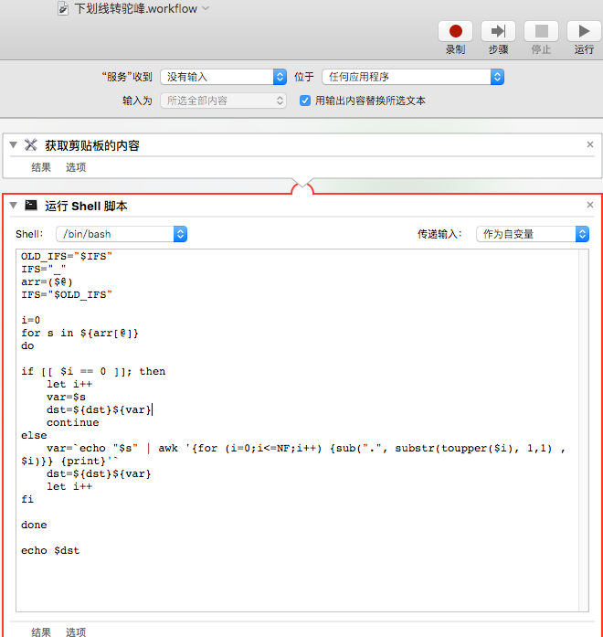

# UnderlineToCamel
将下滑线命名的 key 转为驼峰


## 使用
拷贝原来的 key，在需要的地方粘贴

## 创建
* 打开 automator，创建服务
* 依照下面截图创建。其中的 shell script 在最下方




```
OLD_IFS="$IFS"
IFS="_"
arr=($@)
IFS="$OLD_IFS"

i=0
for s in ${arr[@]} 
do

if [[ $i == 0 ]]; then
	let i++
	var=$s
	dst=${dst}${var}
	continue
else
	var=`echo "$s" | awk '{for (i=0;i<=NF;i++) {sub(".", substr(toupper($i), 1,1) , $i)}} {print}'`
	dst=${dst}${var}
	let i++
fi

done

echo $dst

```
